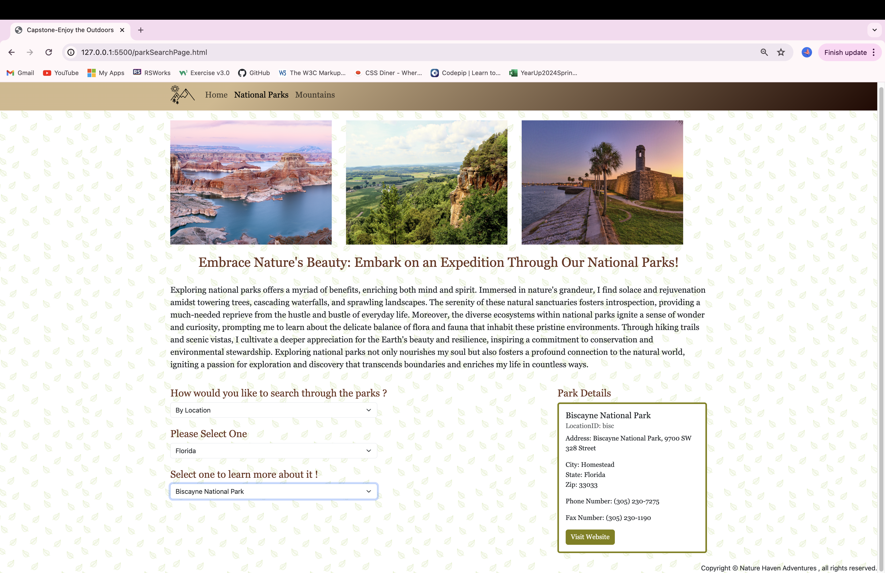

# Nature Haven Adventures

### overall description of project

For my project I used HTML , CSS , JavaScript , and Bootstrap to create a website that shows the user a list of national parks and mountains. 

1. For the website it has three pages. The first page is the home page which shows a carousel with three images to give the user a glimpse of the many parks or mountains they can discover with the help of this website. It then shows a section with an image of a national park alongside a paragraph that encourages the user to browse through the list of national parks. The following section shows an image of a specific mountain and a paragraph explaining how exploring one of the many mountains can be the start of your new journey. 

Then my second page consists of three images of national parks. A pargraph follows after that explaining how exploring can benfit your life. After that there is a dropdown asking you to select a method to search through the parks. The user can either select location or park type which then results in two more dropdowns to be added. The first additional one shows a list of options for location or park type. The last dropdown shows the results of national parks that match those specifications. When the user selects a park a bootstrap card pops up on the right with the parks' details and then disappears whenever a new option is selcted. 

For my third and last page it consists of three images of different mountains. It is followed my a paragraph explaining the feeling of beginning a new adventure and the feeling of being on top of a mountain enjoying the view. The next part is a dropdown asking the user to select a mountain from the list which then produces a bootstrap card. This card contains a image of the selected mountain , the name , a short description, the elevation level and the effort level. It is cleared whenever a new option is selected. 

2. The Javascript part of this project made the whole process intersting. I created two separate js files , one for the National Parks page and the other for the mountain page. There are also four more js files but those are pre-made data that I used to create the two new js files. For both pages I used functions, agruments, if statements, the .createElement , .appendChild, and I created the card inside of the javascript instead of in the HTML. 

3. My css was very basic since I wanted the website to have a simple feel to it. I used it to give the body a background pattern of leaves and to give my navbar a linear-gradient. The css also helped change the look of the images, the cards' appearance, and the text throughtout the website. 

### Describe one piece of code

One intersting part of my whole code was creating the card on both pages. It was the part I spent the most time on since I finding issues that kept making it not appear. It was nice to be able to know how to create a card more than one way now. In the card's code there are mutiple variables created to which are then added to a HTML element. With creating the card , I was able to create divs, img, h5, p, ul, and li elements. This also came with creating classes named like card-text, card-body, card-title, list-group-item, and card-img-top. I also included an if statement in the national park's card because some parks have links to their website while others don't. The whole process of creating and making the function of the cards work with the rest of the code was the toughest part of this project. 

## images of website pages 

